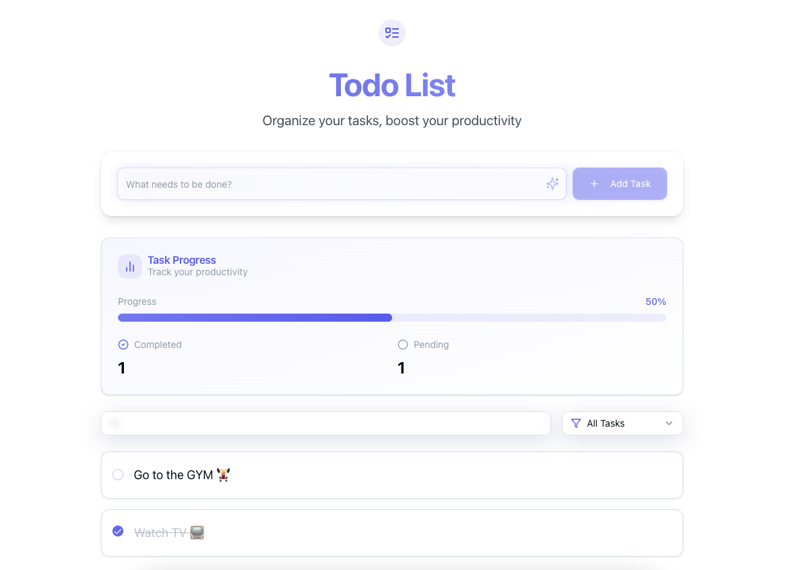

# Advanced Todo Application in Go

A powerful and feature-rich todo application built with Go and Next.js, featuring a clean architecture, RESTful API, and MongoDB for data persistence. The project includes both a backend API and a modern web client interface.

<!-- add preview image (local image) -->
[](https://github.com/yourusername/advanced-todo-using-go)


## 🚀 Features

- **CRUD Operations**: Create, Read, Update, and Delete todos
- **RESTful API**: Well-structured API endpoints
- **Persistent Storage**: Data storage using MongoDB
- **Clean Architecture**: Follows clean code principles and best practices
- **Input Validation**: Request validation and error handling
- **API Documentation**: Comprehensive API documentation
- **Environment Configuration**: Easy setup with environment variables
- **Modern Web UI**: Responsive web interface built with Next.js
- **Real-time Updates**: Instant UI updates when todos change
- **Server-Side Rendering**: Enhanced performance and SEO with Next.js
- **Tailwind CSS**: Modern and responsive styling
- **TypeScript**: Type-safe development

## 📋 Prerequisites

Before running this application, make sure you have the following installed:

- Go (version 1.16 or higher)
- MongoDB
- Git
- Node.js (version 14 or higher)
- Yarn

## 🛠️ Installation

1. Clone the repository:

   ```bash
   git clone https://github.com/yourusername/advanced-todo-using-go.git
   cd advanced-todo-using-go
   ```

2. Install backend dependencies:

   ```bash
   go mod download
   ```

3. Install frontend dependencies:

   ```bash
   cd client
   yarn install
   cd ..
   ```

4. Set up environment variables:
   ```bash
   cp .env.example .env
   # Edit .env file with your MongoDB connection string
   ```

## 🚀 Running the Application

### Backend Development

1. Make sure MongoDB is running locally or you have a valid MongoDB connection string

2. Start the server:

   ```bash
   go run main.go
   ```

3. The API server will start at `http://localhost:8080`

### Frontend Development

1. Navigate to the client directory:

   ```bash
   cd client
   ```

2. Start the development server:

   ```bash
   yarn dev
   ```

3. The web interface will be available at `http://localhost:3000`

## 🔄 API Endpoints

### Todos

- `GET /api/todos` - Get all todos
- `GET /api/todos/:id` - Get a specific todo
- `POST /api/todos` - Create a new todo
- `PUT /api/todos/:id` - Update a todo
- `DELETE /api/todos/:id` - Delete a todo

## 📝 API Documentation

### Todo Object Structure

```json
{
  "id": "objectId",
  "title": "Task title",
  "description": "Task description",
  "completed": false,
  "created_at": "2023-01-01T00:00:00Z",
  "updated_at": "2023-01-01T00:00:00Z"
}
```

### Sample Requests

#### Create Todo

```bash
curl -X POST http://localhost:8080/api/todos \
  -H "Content-Type: application/json" \
  -d '{
    "title": "Complete project",
    "description": "Finish the todo app implementation"
  }'
```

## 🏗️ Project Structure

```
.
├── client/                # Frontend Next.js application
│   ├── src/
│   │   ├── app/         # Next.js app directory
│   │   ├── components/  # React components
│   │   ├── lib/        # Utility functions
│   │   └── types/      # TypeScript type definitions
│   ├── public/         # Static files
│   ├── tailwind.config.ts
│   ├── package.json
│   └── README.md
├── config/             # Backend configuration
│   └── db.go
├── controllers/        # API controllers
│   └── todo.go
├── models/            # Data models
│   └── todo.go
├── routes/            # API routes
│   └── todo.go
├── main.go           # Backend entry point
└── README.md
```

## ⚙️ Configuration

The application can be configured using environment variables:

```env
PORT=8080
MONGO_URI=mongodb://localhost:27017/go_todos
```

## 💻 Web Interface Features

- **Modern UI with Tailwind**: Clean and responsive design using Tailwind CSS
- **Server-Side Rendering**: Fast page loads and SEO optimization
- **TypeScript Support**: Type-safe development experience
- **Real-time Updates**: Instant feedback when creating, updating, or deleting todos
- **Filter and Search**: Easily find todos with search and filter options
- **Sort Options**: Sort todos by creation date, due date, or completion status
- **Mobile Responsive**: Works seamlessly on all device sizes

